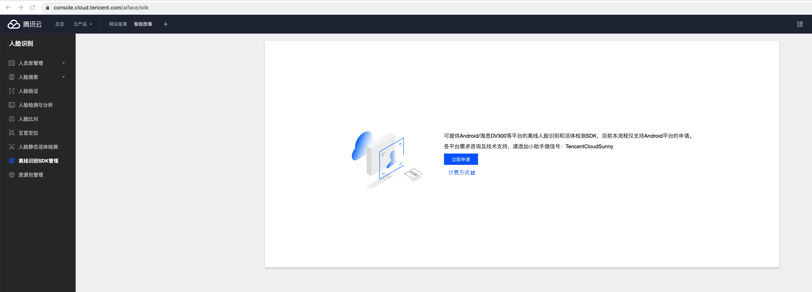
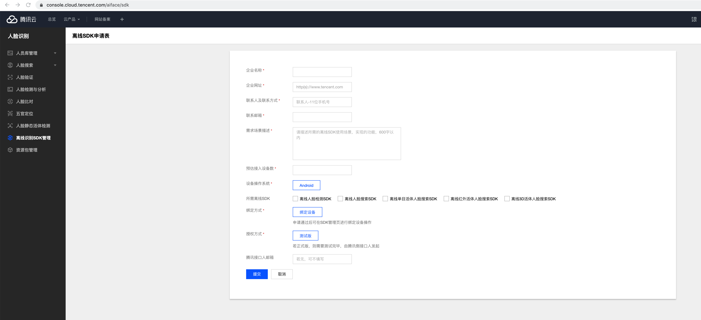
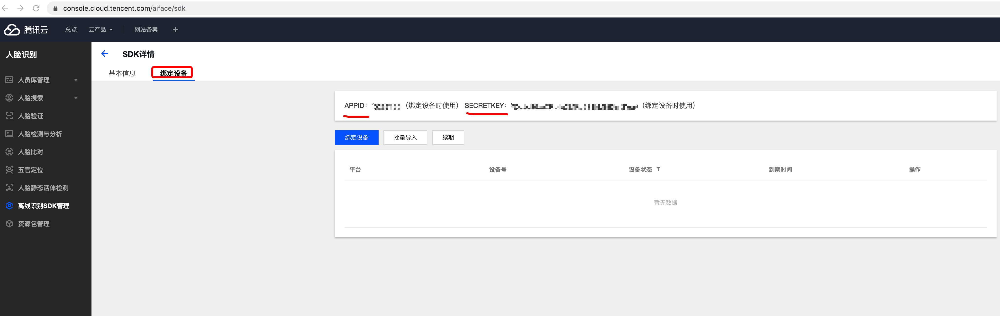
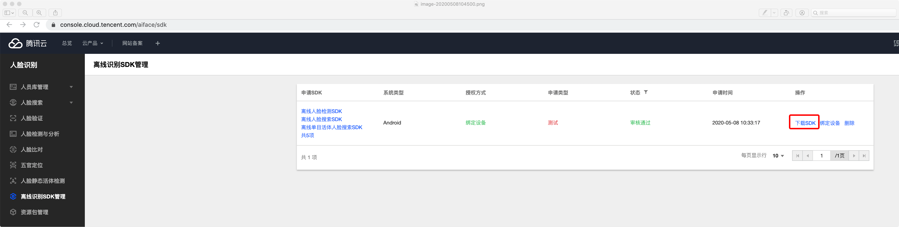
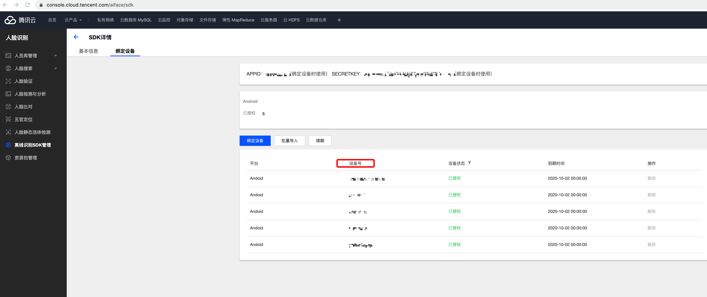

# 准备工作

无论是免费试用（有效期2个月，按设备授权绑定数量为3台）, 还是正式商用（需签订商用合同）, 都需要先申请授权.

## 使用按设备授权方式
提供按设备授权方式

计费模式, 详见 **计费概述**: 
[人脸识别](https://cloud.tencent.com/product/facerecognition) =>  [定价](https://cloud.tencent.com/product/facerecognition/pricing) => [计费概述](https://cloud.tencent.com/document/product/867/17640)

按设备授权的方式不限使用时间，即设备一旦完成授权则永久有效

## 提交申请

1. 到 [人脸识别控制台](https://console.cloud.tencent.com/aiface/sdk) 点击 "立即申请" 按钮  
2. 账号必须先通过企业认证 
3. 填写申请信息

然后等待审核通过, 一般在 1 个工作日内完成.

# 申请通过后
#### 1. 记录APPID和SECRTEKEY
- 点击SDK列表，进入SDK详情 - 绑定设备页 

- 记录 `APPID` 和 `SECRET_KEY` , 后续激活 SDK 代码需要用到

    

#### 2. 下载, 修改, 运行

- 点击 "下载SDK" 按钮, 下载得到 SDK 压缩包 
- 解开压缩包, 得到一个 Android 工程, 其中包含 **SDK** 和 **示例 Demo** , 用 `Android Studio` 打开工程
- 找到  `AuthActivity.java` 文件, 搜索 `onAllPermissionGranted` 位置, 填上上面申请的 `APPID` 和  `SECRET_KEY` 

    ```java
    // 请修改人脸识别 SDK 授权信息
    AuthResult authResult = auth(AuthActivity.this, "123456"/*修改APPID为实际的值*/, "Y7QinfHe6CF3bsuqV6vTr00"/*修改SECRET_KEY为实际的值*/);
    ```

#### 3. 检查设备是否授权成功

- 编译工程, 并在设备上运行.
  
- `Android Studio` 查看 `Logcat` 日志输出, 过滤 `授权` 字样, 可以看到 `授权成功` 或 `授权失败` 的字样.

- Demo App 启动时界面也会在界面顶部显示授权结果信息.

- 也可以在[SDK控制台](https://console.cloud.tencent.com/aiface/sdk) - SDK详情 - 绑定设备 列表查看已绑定设备

  校验 - 本地查看设备序列号（即SDK控制台的绑定设备列表表头的设备号）：

  Android 设备的序列号可以通过以下 2 种方式获得：

  1. 设备连接电脑，执行 adb 命令：`adb shell getprop | grep serial`
     一般而言，序列号为 `ro.serialno` 对应值；部分三星手机，序列号为 `ril.serialnumber` 对应值
  2. 在设备上选择【设置】->【关于手机】->【状态】里面查看【序列号】（如图，不同系统可能稍有区别）

  


