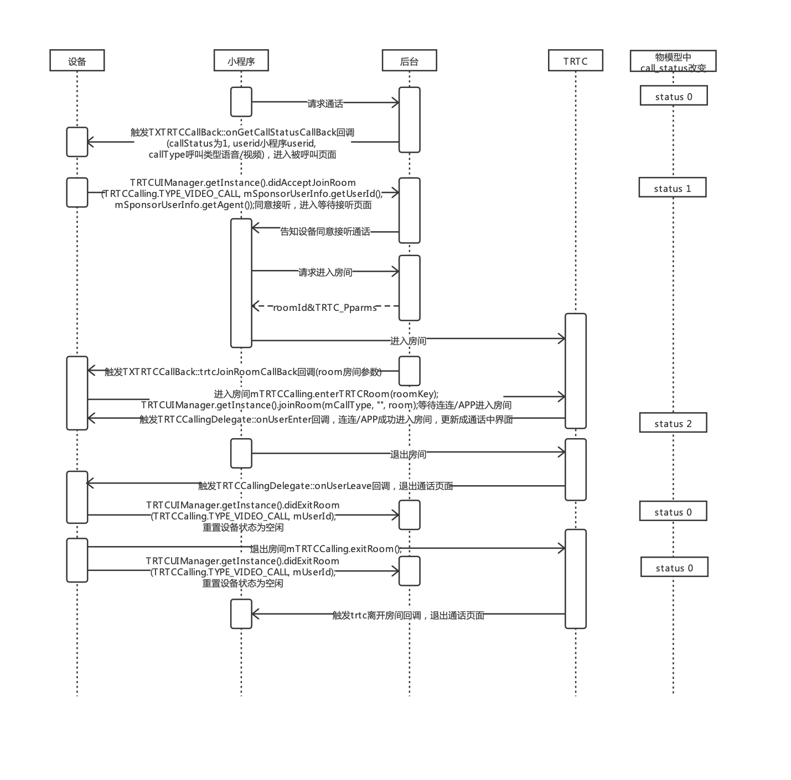

* [IoT Explorer RTC Android SDK开发指南](#IoT-Explorer-RTC-Android-SDK开发指南)
  * [引用方式](#引用方式)
  * [API说明](#API说明)
     *  [explorer-device-android SDK 设计说明](#explorer-device-android-SDK-设计说明)
     *  [explorer-device-rtc SDK 设计说明](#explorer-device-rtc-SDK-设计说明)
     *  [explorer-device-rtc SDK 回调callback 设计说明](#explorer-device-rtc-SDK-回调callback-设计说明)
  * [通话流程梳理](#通话流程梳理)

# IoT Explorer RTC Android SDK开发指南

本文主要描述腾讯云物联网开发平台设备端IoT Explorer Android-SDK中接入腾讯云实时音视频 TRTC Android-SDK 开发指南 。

## 引用方式

- 集成 SDK 方式

如果不需要接入实时音视频 TRTC SDK，仅需要接入explorer-device-android SDK，请参考 [编译环境及SDK接入说明.md](../explorer-device-android/docs/zh/编译环境及SDK接入说明.md)

 -  gradle 工程 正式版SDK 远程构建

    在应用模块的build.gradle中配置，具体版本号可参考 [Latest release](https://github.com/tencentyun/iot-device-java/releases) 版本 
    ``` gr
    dependencies {
        implementation 'com.tencent.iot.explorer:explorer-device-rtc:x.x.x' //IoT Explorer 与 实时音视频 TRTC 的依赖
    }
    ```
 -  gradle 工程 snapshot版SDK 远程构建

    > 建议使用正式版SDK，SNAPSHOT版本会静默更新，使用存在风险

    在工程的build.gradle中配置仓库url
    ``` gr
    allprojects {
        repositories {
            google()
            jcenter()
            maven {
                url "https://oss.sonatype.org/content/repositories/snapshots"
            }
        }
    }
    ```
    在应用模块的build.gradle中配置，具体版本号可参考 [Latest release](https://github.com/tencentyun/iot-device-java/releases) 版本，末位+1
    ``` gr
    dependencies {
        implementation 'com.tencent.iot.explorer:explorer-device-rtc:x.x.x-SNAPSHOT' //IoT Explorer 与 实时音视频 TRTC 的依赖
    }
    ```
 -  依赖本地sdk源码 构建
    修改应用模块的 **[build.gradle](../device-android-demo/build.gradle)**，使应用模块依赖 [explorer-device-rtc](../explorer-device-rtc)源码，示例如下：
    
     ```gr
    dependencies {
        implementation project(':explorer:explorer-device-rtc') //IoT Explorer 与 实时音视频 TRTC 的依赖，注意添加相互依赖的其他sdk module
    }
     ```

Demo示例工程使用的是 依赖本地 explorer-device-android 和 explorer-device-rtc 的 sdk源码 构建方式。

## API说明

### explorer-device-android SDK 设计说明

explorer-device-android 请参考 [SDK API及参数说明.md](../explorer-device-android/docs/SDK%20API及参数说明.md)

### explorer-device-rtc SDK 设计说明

| 类名                     | 功能                                         |
| ----------------------- | -------------------------------------------- |
| TXTRTCDataTemplate      | 实现实时音视频数据模板基本功能                   |
| TXTRTCTemplateClient    | 实现直连设备根据实时音视频数据模板连接物联网开发平台|

#### TXTRTCDataTemplate

TXTRTCDataTemplate 继承自 TXDataTemplate类

```
    /**
     * 上报实时音视频类设备呼叫属性
     * @param callStatus 呼叫状态 0 - 空闲或拒绝呼叫  1 - 进行呼叫  2 - 通话中
     * @param callType 邀请类型 1-语音通话，2-视频通话
     * @param userId 被呼叫用户id 多个用户id用";"分割，      也可以为空字符串""，表示群呼，      也可以为字符串"null"，传入params，请做数据转发到您的后台服务，请参考: https://cloud.tencent.com/document/product/1081/40298
     * @param agent 代理方  标识哪一方发起的呼叫，可以传空字符串，则不会上报agent。
     * @param params 用户的物模型属性json
     * @return 发送请求成功时返回Status.OK;。 OK 成功， ERROR 发生错误， ERR_JSON_CONSTRUCT json构造失败， PARAMETER_INVALID Topic无效， MQTT_NO_CONN MQTT未连接
     */
    public Status reportCallStatusProperty(Integer callStatus, Integer callType, String userId, String agent, JSONObject params)
```


#### TXTRTCTemplateClient

TXTRTCTemplateClient 继承自 TXMqttConnection 类

```
    /**
     * 是否已经连接物联网开发平台
     * @return 是 、 否
     */
    public boolean isConnected()

    /**
     * 订阅数据模板相关主题
     * @param topicId 主题ID
     * @param qos QOS等级
     * @return 发送请求成功时返回Status.OK;
     */
    public Status subscribeTemplateTopic(TXDataTemplateConstants.TemplateSubTopic topicId, final int qos)

    /**
     * 取消订阅数据模板相关主题
     * @param topicId 主题ID
     * @return 发送请求成功时返回Status.OK;
     */
    public Status unSubscribeTemplateTopic(TXDataTemplateConstants.TemplateSubTopic topicId)

    /**
     * 属性上报
     * @param property 属性的json
     * @param metadata 属性的metadata，目前只包含各个属性对应的时间戳
     * @return 发送请求成功时返回Status.OK;
     */
    public Status propertyReport(JSONObject property, JSONObject metadata)

    /**
     * 上报实时音视频类设备呼叫属性
     * @param callStatus 呼叫状态 0 - 空闲或拒绝呼叫  1 - 进行呼叫  2 - 通话中
     * @param callType 邀请类型 1-语音通话，2-视频通话
     * @param userId 被呼叫用户id 多个用户id用";"分割，      也可以为空字符串""，表示群呼，      也可以为字符串"null"，传入params，请做数据转发到您的后台服务，请参考: https://cloud.tencent.com/document/product/1081/40298
     * @param agent 代理方  标识哪一方发起的呼叫，可以传空字符串，则不会上报agent。
     * @param params 用户的物模型属性json
     * @return 发送请求成功时返回Status.OK;
     */
    public Status reportCallStatusProperty(Integer callStatus, Integer callType, String userId, String agent, JSONObject params)

    /**
     * 获取状态
     * @param type 类型
     * @param showmeta 是否携带showmeta
     * @return 发送请求成功时返回Status.OK;
     */
    public Status propertyGetStatus(String type, boolean showmeta)

    /**
     * 设备基本信息上报
     * @param params 参数
     * @return 发送请求成功时返回Status.OK;
     */
    public Status propertyReportInfo(JSONObject params)

    /**
     * 清理控制信息
     * @return 发送请求成功时返回Status.OK;
     */
    public Status propertyClearControl()

    /**
     * 单个事件上报
     * @param eventId 事件ID
     * @param type 事件类型
     * @param params 参数
     * @return 发送请求成功时返回Status.OK;
     */
    public Status eventSinglePost(String eventId, String type, JSONObject params)

    /**
     * 多个事件上报
     * @param events 事件集合
     * @return 发送请求成功时返回Status.OK;
     */
    public Status eventsPost(JSONArray events)
```

### explorer-device-rtc SDK 回调callback 设计说明

TXTRTCCallBack 授权回调callback说明如下：

```
    /**
     * 获取RTC属性呼叫状态
     *
     * @param callStatus            呼叫状态 0 - 空闲或拒绝呼叫  1 - 进行呼叫  2 - 通话中
     * @param userid                用户id
     * @param agent                 代理方  标识哪一方发起的呼叫。
     * @param callType              邀请类型 1-语音通话，2-视频通话
     */
    public abstract void onGetCallStatusCallBack(Integer callStatus, String userid, String agent, Integer callType);

    /**
     * 获取rtc进入房间所需参数模型
     *
     * @param room
     */
    public abstract void trtcJoinRoomCallBack(RoomKey room);
```

## 设备与用户绑定说明

Android设备通常具备丰富的人机交互界面（屏幕/键盘），用户可以直接输入 SSID/PSW 进行连接入网。

可使用`连连APP/小程序`扫描由以下接口生成的二维码，建立用户与设备之间的绑定关系。

```
explorer-device-android TXMqttConnection 类 的接口
    /**
     * 生成绑定设备的二维码字符串
     * @return 生成的绑定设备的二维码字符串;
     */
    public String generateDeviceQRCodeContent()

    /**
     * 生成支持微信扫一扫跳转连连小程序的绑定设备的二维码字符串
     * @return 生成的绑定设备的二维码字符串;
     */
    public String generateDeviceWechatScanQRCodeContent()
```

## 通话流程梳理

### 连连APP/小程序 视频呼叫 Android设备端

时序图：



1. 连连APP/小程序 在控制面板页面中点击 视频呼叫。

2. 云服务通过mqtt转发 连连APP/小程序 的呼叫请求，触发设备端 TXTRTCCallBack 中 onGetCallStatusCallBack 回调，其中：
> * 回调参数 callStatus 为1（进行呼叫）
> * userid 为 连连APP/小程序 的发起呼叫的用户id
> * agent为代理方，标识哪一方发起的呼叫。
> * callType为步骤1中传递的对应呼叫的类型

接到此消息后需要调用
```
TRTCUIManager.getInstance().setSessionManager(new TRTCExplorerDemoSessionManager(mDataTemplateSample)); //方便在页面中上报设备的状态
TRTCVideoCallActivity.startBeingCall(TRTCMainActivity.this, new RoomKey(), userid, agent);//跳转到对应的视频被呼叫页面
```

3、当设备端点击了接听按钮时，需要调用
``` 
TRTCUIManager.getInstance().didAcceptJoinRoom(TRTCCalling.TYPE_VIDEO_CALL, mSponsorUserInfo.getUserId(), mSponsorUserInfo.getAgent());
```
告知 连连APP/小程序 的用户设备同意此次呼叫请求。

4、云服务通过websocket转发 设备端同意当前 连连APP/小程序 用户的呼叫请求，连连APP/小程序 继续请求进入房间参数，并进入对应的视频房间。

5、云服务通过mqtt转发 连连APP/小程序 进入房间行为，触发设备端 TXTRTCCallBack 中 trtcJoinRoomCallBack 回调，其中
> * 回调参数 room 为对应的房间参数

接到此消息后需要调用
``` 
TRTCUIManager.getInstance().joinRoom(mCallType, "", room); //加入房间，更新视频呼叫属性为通话中。
``` 

6、连连APP/小程序 和 设备端 进行视频通话。

7、当主动挂断，或收到对方挂断的回调 ``` public void onUserLeave(final String userId) ``` 后，退出当前音视频页面并调用 
``` 
TRTCUIManager.getInstance().didExitRoom(TRTCCalling.TYPE_VIDEO_CALL, mSponsorUserInfo.getUserId()); //更新视频呼叫属性为空闲。
``` 

**连连APP/小程序 音频呼叫 Android设备端 流程和视频呼叫类似，注意修改对应的呼叫类型**

### Android设备端 视频呼叫 连连APP/小程序

1、设备端点击视频呼叫，需要调用
```
mDataTemplateSample.reportCallStatusProperty(TRTCCallStatus.TYPE_CALLING, TRTCCalling.TYPE_VIDEO_CALL, userId, agent, null); //更新视频呼叫属性为进行呼叫。
TRTCUIManager.getInstance().setSessionManager(new TRTCExplorerDemoSessionManager(mDataTemplateSample)); //方便在页面中上报设备的状态
TRTCVideoCallActivity.startCallSomeone(TRTCMainActivity.this, agent, userId);//跳转到对应的视频呼叫页面  
```

2、云服务通过mqtt转发 设备端 的呼叫请求，连连APP/小程序 跳转到被呼叫页面，当用户点击了同意当前 设备端 呼叫请求时，连连APP/小程序 继续请求进入房间参数，并进入对应的视频房间。

3、云服务通过mqtt转发 连连APP/小程序 进入房间行为，触发设备端 TXTRTCCallBack 中 trtcJoinRoomCallBack 回调，其中
> * 回调参数 room 为对应的房间参数

接到此消息后需要调用
``` 
TRTCUIManager.getInstance().joinRoom(mCallType, "", room); //加入房间，更新视频呼叫属性为通话中。
``` 

4、连连APP/小程序 和 设备端 进行视频通话。

5、当主动挂断，或收到对方挂断的回调 ``` public void onUserLeave(final String userId) ``` 后，退出当前音视频页面并调用 
``` 
TRTCUIManager.getInstance().didExitRoom(TRTCCalling.TYPE_VIDEO_CALL, mSponsorUserInfo.getUserId()); //更新视频呼叫属性为空闲。
``` 

**Android设备端 音频呼叫 连连APP/小程序 流程和视频呼叫类似，注意修改对应的呼叫类型**