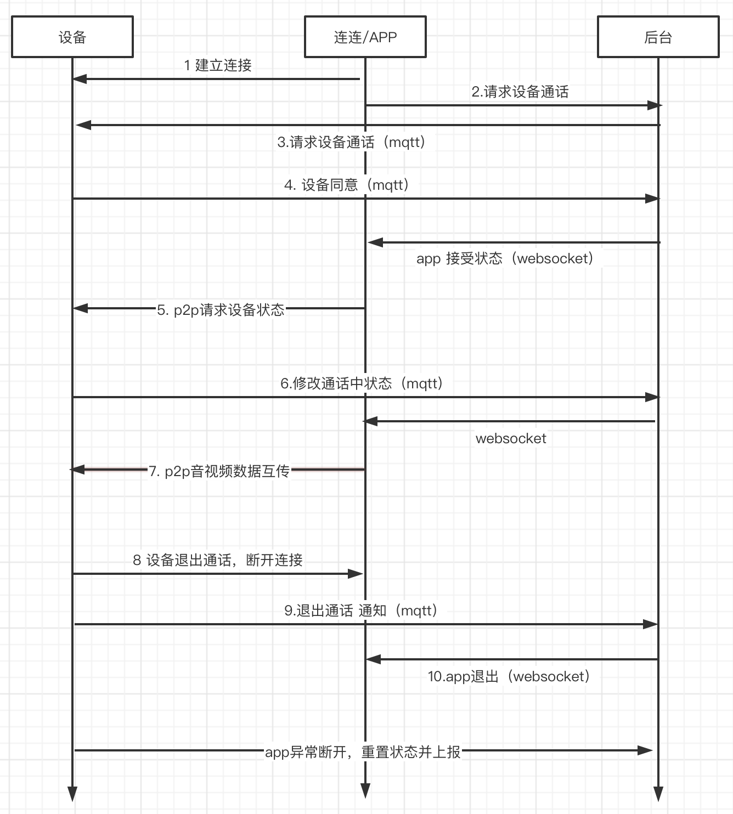

### 1. 建立连接
app进入设备控制面板页面，开始startp2pservice

### 2. 手机发起请求设备通话
手机调用应用端 API [AppControlDeviceData](https://cloud.tencent.com/document/product/1081/40805), Data参数事例（Data参数为控制设备报文jsonString）:

``
"Data": "{\"_sys_video_call_status\":1, \"username\":\"father\", \"_sys_userid\":\"20001\", \"_sys_caller_id\":\"20001\", \"_sys_called_id\":\"OIUYKJHGBV/device01\", \"_sys_user_agent\":\"android/1.0.0 (Android 29;HUAWEI ELS-AN00;zh-CN)\"}"
``

Data参数具体字段含义：
1. _sys_video_call_status为1（呼叫中）
2. username为app用户的昵称, 设备主呼时可不填
3. _sys_userid 用于区分是否有App参与, 设备呼设备则不填; 为app用户的userId, 无论App是主呼还是被呼
4. _sys_caller_id为主呼叫方id，app呼叫设备时，即app用户的userId
5. _sys_called_id为被呼叫方id，app呼叫设备时，即设备的deviceId
6. _sys_user_agent为用户代理，用于区分呼叫来源
   - 如小程序传递示例："weapp/1.0.0 (Android 29;HUAWEI ELS-AN00;zh-CN;H5)"
   - 设备端传递示例："device/1.0.0 (Android 29;HUAWEI ELS-AN00;zh-CN)"
   - iOS App端传递示例："ios/1.0.0 (ios;iphone 13;zh-CN)"
   - android App端传递示例："android/1.0.0 (Android 29;HUAWEI ELS-AN00;zh-CN)"


### 3. 请求设备通话接口后，IOT云通过mqtt 通知给设备   _sys_video_call_status 状态
- 0 表示设备空闲或者不愿意接听
- 1 表示设备准备进入通话状态
- 2 表示设备正在通话中

设备收到的消息格式如下
```
 Topic:$thing/down/property/${productID}/${deviceName}
 Payload:
 {
   "method": "control",
   "clientToken": "123",
   "params": {
     "_sys_video_call_status":1,
     "username":"father",
     "_sys_userid": "20001",
     "_sys_caller_id": "20001",
     "_sys_called_id": "OIUYKJHGBV/device01",
     "_sys_user_agent": "android/1.0.0 (Android 29;HUAWEI ELS-AN00;zh-CN)"
   }
 }
```

### 4.1. 设备同意(拒绝)通话请求接口
- 这个消息也是对手机呼叫设备的应答, "_sys_video_call_status": 1，上报为1 ; 表示设备愿意进行呼叫. 
- 假如设备拒绝手机通话, "_sys_video_call_status": 0， 上报为0 ;
- 假如设备无法应答, 就不上报就好

设备端上报MQTT消息事例
```json
Topic: $thing/up/property/${productID}/${deviceName}
Payload:
{
  "method": "report",
  "clientToken": "456",
  "timestamp": 1212121221,
  "params": {
    "_sys_video_call_status": 1,
    "_sys_userid": "20001",
    "_sys_caller_id": "20001",
    "_sys_called_id": "OIUYKJHGBV/device01",
    "_sys_user_agent": "android/1.0.0 (Android 29;HUAWEI ELS-AN00;zh-CN)"
  }
}
```

### 4.2. app呼叫设备期间，app放弃呼叫。
手机调用应用端API [AppControlDeviceData](https://cloud.tencent.com/document/product/1081/40805) 
   Data参数事例（Data参数为控制设备报文jsonString）：

``
"Data": "{\"_sys_video_call_status\":0, \"username\":\"father\", \"_sys_userid\":\"20001\", \"_sys_caller_id\":\"20001\", \"_sys_called_id\":\"OIUYKJHGBV/device01\", \"_sys_user_agent\":\"android/1.0.0 (Android 29;HUAWEI ELS-AN00;zh-CN)\"}"
``

Data参数具体字段含义：
1. _sys_video_call_status为0（放弃呼叫），
2. username为app用户的昵称
3. _sys_userid为app用户的userId，
4. _sys_caller_id为主呼叫方id，app呼叫设备时，即app用户的userId，
5. _sys_called_id为被呼叫方id，app呼叫设备时，即设备的deviceId，
6. _sys_user_agent为用户代理，用于区分呼叫来源

### 5. p2p请求设备状态
app 通过信令 get_device_state 请求设备p2p
``
action=inner_define&channel=xxx&cmd=get_device_st&type=(voice/live/playback)&quality=standard
``

### 6. 设备和手机进入通话中请求接口
设备要上报物模型 _sys_video_call_status 状态 2
```json
Topic: $thing/up/property/${productID}/${deviceName}
Payload:
{
    "method": "report",
    "clientToken": "456",
    "timestamp": 1212121221,
    "params": {
        "_sys_video_call_status": 2,
        "_sys_userid": "20001",
        "_sys_caller_id": "20001",
        "_sys_called_id": "OIUYKJHGBV/device01",
        "_sys_user_agent": "android/1.0.0 (Android 29;HUAWEI ELS-AN00;zh-CN)"
    }
}
```

### 7. p2p音视频数据互传
app获取播放 url， 启动播放器拉取设备流。

同时，启动voice req带参数 calltype=video/audio，senddata发送flv数据给到设备

### 8.1. 设备挂断通话
设备调用 p2p 的 voice req close，app会收到 voice complete 回调

### 8.2. APP 挂断通话
app 调用 p2p 的 stop voice ，设备会收到 voice complete 回调

### 9. 设备结束通话请求接口
设备要上报物模型 _sys_video_call_status 状态 0
```json
Topic: $thing/up/property/${productID}/${deviceName}
Payload:
{
    "method": "report",
    "clientToken": "456",
    "timestamp": 1212121221,
    "params": {
        "_sys_video_call_status": 0,
        "_sys_userid": "20001",
        "_sys_caller_id": "20001",
        "_sys_called_id": "OIUYKJHGBV/device01",
        "_sys_user_agent": "android/1.0.0 (Android 29;HUAWEI ELS-AN00;zh-CN)"
  }
}
```
