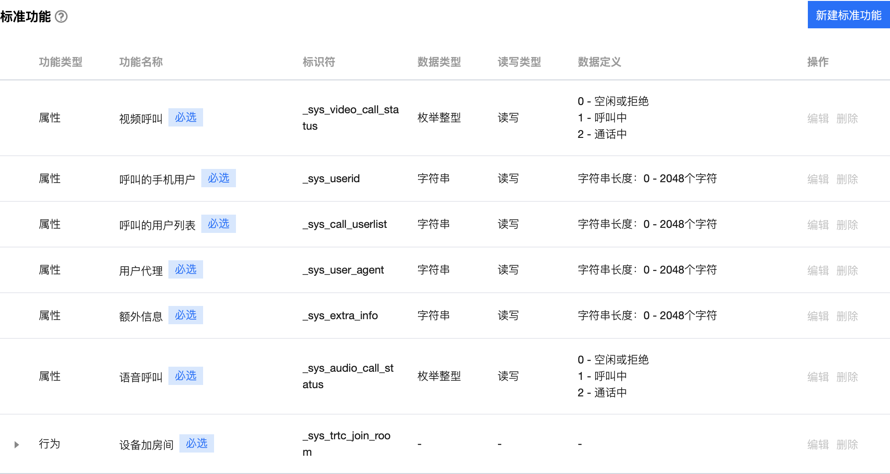
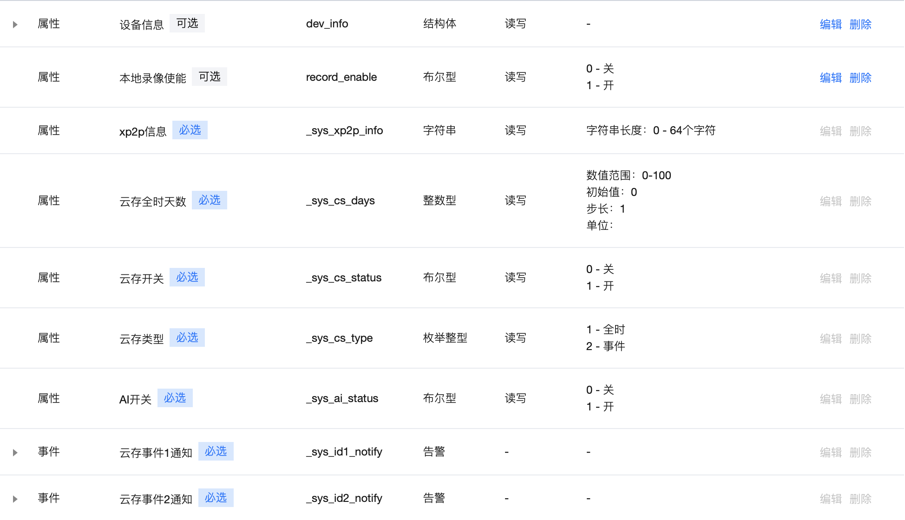

### 物模型整理参考：

（下图为 TRTC 设备物模型参考，[物模型详细说明](http://tapd.oa.com/NEW_IOT/markdown_wikis/show/#1220393192001962849)）

（下图为 video 设备物模型参考）

### video物模型属性更新说明：
>1.   video新增加物模型属性：_sys_called_id为被呼叫方id（被呼叫的是手机，_sys_called_id就设置用户的userId，如果被呼叫的设备，_sys_called_id就设置设备的deviceId）
_sys_caller_id为主呼叫方id（主呼叫的是手机，_sys_caller_id就设置用户的userId，如果主呼叫的设备，_sys_caller_id就设置设备的deviceId）。
>2.   video不需要trtc中的_sys_trtc_join_room的行为，因video中音视频通话不存在房间的概念，所以在设备呼叫app时，app拒绝或者同意接听是手机调用应用端API AppControlDeviceData ，来通知设备。