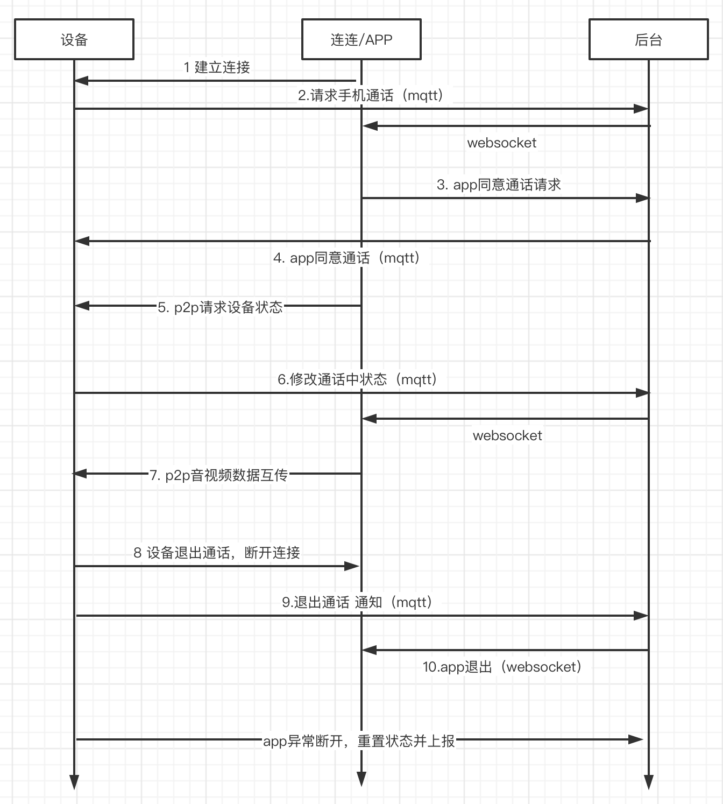

### 1. 建立连接
app进入设备控制面板页面，开始startp2pservice

### 2. 设备请求手机通话
设备要上报物模型 _sys_video_call_status 状态 1
```json
Topic: $thing/up/property/${productID}/${deviceName}
Payload:
{
    "method": "report",
    "clientToken": "456",
    "timestamp": 1212121221,
    "params": {
        "_sys_video_call_status": 1,
        "_sys_userid": "20001",
        "_sys_caller_id": "OIUYKJHGBV/device01",
        "_sys_called_id": "20001",
        "_sys_user_agent": "device/1.0.0 (Android 29;HUAWEI ELS-AN00;zh-CN)"
    }
}
```
上报属性参数具体字段含义：
1. _sys_video_call_status为1（呼叫中）
2. username为app用户的昵称, 设备主呼时可不填
3. _sys_userid 用于区分是否有App参与, 设备呼设备则不填; 为app用户的userId, 无论App是主呼还是被呼
4. _sys_caller_id为主呼叫方id，设备呼叫APP时，即设备的deviceId
5. _sys_called_id为被呼叫方id，设备呼叫APP时，即app用户的userId
6. _sys_user_agent为用户代理，用于区分呼叫来源
   - 如小程序传递示例："weapp/1.0.0 (Android 29;HUAWEI ELS-AN00;zh-CN;H5)"
   - 设备端传递示例："device/1.0.0 (Android 29;HUAWEI ELS-AN00;zh-CN)"
   - iOS App端传递示例："ios/1.0.0 (ios;iphone 13;zh-CN)"
   - android App端传递示例："android/1.0.0 (Android 29;HUAWEI ELS-AN00;zh-CN)"


### 3 App同意或拒绝通话请求
手机调用应用端 API [AppControlDeviceData](https://cloud.tencent.com/document/product/1081/40805), Data参数事例（Data参数为控制设备报文jsonString）:

``
 "Data": "{\"_sys_video_call_status\":1, \"username\":\"father\", \"_sys_userid\":\"20001\", \"_sys_caller_id\":\"OIUYKJHGBV/device01\", \"_sys_called_id\":\"20001\", \"_sys_user_agent\":\"device/1.0.0 (Android 29;HUAWEI ELS-AN00;zh-CN)\"}"
``

_sys_video_call_status为1（手机同意接听），为0（拒绝接听）

### 4.1. 请求手机通话接口

- 若App同意通话请求, 设备会收到IOT云发出给设备的mqtt控制消息，其中 _sys_video_call_status 状态 1
- 若App拒绝通话请求, 设备会收到IOT云发出给设备的mqtt控制消息，其中 _sys_video_call_status 状态 0，当收到该消息时，设备还需参考4.2步骤report _sys_video_call_status 状态 0，将设备状态置为空闲。

设备端上报MQTT消息事例
```json
Topic:$thing/down/property/${productID}/${deviceName}
Payload:
{
    "method": "control",
    "clientToken": "123",
    "params": {
        "_sys_video_call_status":1,
        "username":"father",
        "_sys_userid": "20001",
        "_sys_caller_id": "OIUYKJHGBV/device01",
        "_sys_called_id": "20001",
        "_sys_user_agent": "device/1.0.0 (Android 29;HUAWEI ELS-AN00;zh-CN)"
    }
}
```

### 4.2. 设备呼叫app期间，设备放弃呼叫
设备要上报物模型 _sys_video_call_status 状态 0
```json
Topic: $thing/up/property/${productID}/${deviceName}
Payload:
{
    "method": "report",
    "clientToken": "456",
    "timestamp": 1212121221,
    "params": {
        "_sys_video_call_status": 0,
        "_sys_userid": "20001",
        "_sys_caller_id": "OIUYKJHGBV/device01",
        "_sys_called_id": "20001",
        "_sys_user_agent": "device/1.0.0 (Android 29;HUAWEI ELS-AN00;zh-CN)"
    }
}
```

### 5. p2p请求设备状态

app 通过信令 get_device_state 请求设备p2p
``
action=inner_define&channel=xxx&cmd=get_device_st&type=(voice/live/playback)&quality=standard
``

### 6. 设备和手机进入通话中请求接口
设备要上报物模型 _sys_video_call_status 状态 2
```json
Topic: $thing/up/property/${productID}/${deviceName}
Payload:
{
    "method": "report",
    "clientToken": "456",
    "timestamp": 1212121221,
    "params": {
        "_sys_video_call_status": 2,
        "_sys_userid": "20001",
        "_sys_caller_id": "OIUYKJHGBV/device01",
        "_sys_called_id": "20001",
        "_sys_user_agent": "device/1.0.0 (Android 29;HUAWEI ELS-AN00;zh-CN)"
    }
}
```

### 7. p2p音视频数据互传
app获取播放 url， 启动播放器拉取设备流。

同时，启动voice req带参数 calltype=video/audio，senddata发送flv数据给到设备

### 8.1. 设备挂断通话
设备调用 p2p 的 voice req close，app会收到 voice complete 回调

### 8.2. APP 挂断通话
app 调用 p2p 的 stop voice ，设备会收到 voice complete 回调

### 9. 设备结束通话请求接口
设备要上报物模型 _sys_video_call_status 状态 0
```json
Topic: $thing/up/property/${productID}/${deviceName}
Payload:
{
    "method": "report",
    "clientToken": "456",
    "timestamp": 1212121221,
    "params": {
        "_sys_video_call_status": 0,
        "_sys_userid": "20001",
        "_sys_caller_id": "OIUYKJHGBV/device01",
        "_sys_called_id": "20001",
        "_sys_user_agent": "device/1.0.0 (Android 29;HUAWEI ELS-AN00;zh-CN)"
    }
}
```
